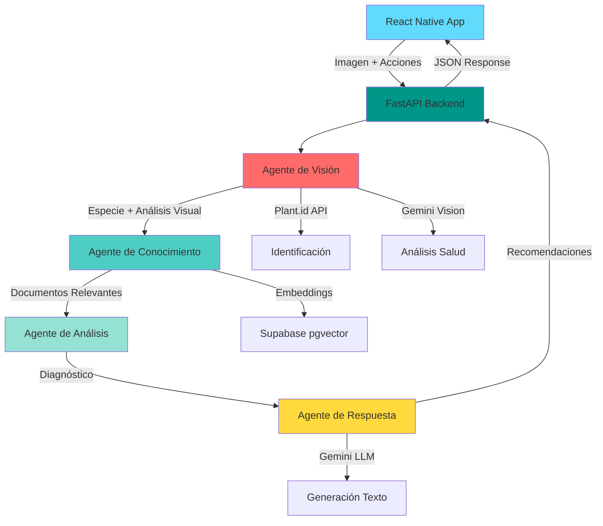

# 🌱 PlantCare AI - Asistente Inteligente de Cuidado de Plantas

> **Proyecto Final - Introducción a la Inteligencia Artificial**  
> Tecnología en Desarrollo de Software

[](https://reactnative.dev/)
[](https://fastapi.tiangolo.com/)
[](https://python.org/)
[](https://supabase.com/)

## 📖 Descripción

PlantCare AI es una aplicación móvil multiplataforma (iOS/Android) que utiliza inteligencia artificial para ayudarte a cuidar tus plantas. Toma una foto de tu planta, describe qué has hecho con ella, y recibe un análisis completo de su salud con recomendaciones personalizadas.

### ✨ Características Principales

- 🔍 **Identificación de Especies**: Reconoce más de 10,000 especies de plantas
- 💚 **Análisis de Salud**: Evalúa el estado de tu planta del 1 al 10
- 🩺 **Diagnóstico Inteligente**: Detecta problemas como exceso de riego, plagas, falta de luz
- 💡 **Recomendaciones Personalizadas**: Consejos específicos basados en tus acciones y la especie
- 📱 **Interfaz Moderna**: Diseño hermoso con animaciones fluidas
- 🤖 **Arquitectura Multi-Agente**: 4 agentes de IA trabajando en conjunto

## 🎓 Cumplimiento de Requisitos del Curso

Este proyecto integra todos los componentes esenciales aprendidos:

- ✅ **Extracción de datos**: Módulo que lee documentos de cuidado de plantas
- ✅ **Chunking**: Segmentación inteligente de textos (chunks de 400 caracteres con overlap)
- ✅ **Embeddings**: Vectorización con `sentence-transformers` (all-MiniLM-L6-v2)
- ✅ **Similitud**: Búsqueda por similitud del coseno
- ✅ **Base de datos vectorial**: Supabase con extensión pgvector
- ✅ **Arquitectura multi-agente con LangChain**:
  - **Agente de Visión**: Google Gemini Vision + Plant.id API
  - **Agente de Conocimiento**: Búsqueda vectorial en Supabase
  - **Agente de Análisis**: Diagnóstico basado en síntomas
  - **Agente de Respuesta**: Orquestador LangChain + generación con Gemini
- ✅ **Interfaz interactiva**: React Native con Expo
- ✅ **Repositorio en GitHub**: Código organizado y documentado

## 🏗️ Arquitectura del Sistema



## 🚀 Instalación y Configuración

### Prerrequisitos

- **Python 3.9+**
- **Node.js 16+** y npm
- **Expo CLI**: `npm install -g expo-cli`
- Cuenta en [Supabase](https://supabase.com) (gratis)
- API Keys gratuitas:
  - [Google Gemini API](https://ai.google.dev/)
  - [Plant.id API](https://plant.id)

### 1️⃣ Backend (FastAPI)

```bash
# Navegar al directorio del backend
cd plant-care-ai-backend

# Crear entorno virtual
python -m venv venv

# Activar entorno virtual
# Windows:
venv\Scripts\activate
# macOS/Linux:
source venv/bin/activate

# Instalar dependencias
pip install -r requirements.txt

# Configurar variables de entorno
cp .env.example .env
# Editar.env con tus API keys
```

#### Configuración de Supabase

1. Crear proyecto en [supabase.com](https://supabase.com)
2. En el **SQL Editor**, ejecutar:

```sql
-- Habilitar extensión vectorial
create extension if not exists vector;

-- Crear tabla de documentos
create table if not exists plant_documents (
  id bigserial primary key,
  chunk_id text unique not null,
  source_file text not null,
  chunk_index int not null,
  text text not null,
  embedding vector(384),
  created_at timestamptz default now()
);

-- Crear índice vectorial
create index on plant_documents using ivfflat (embedding vector_cosine_ops);

-- Función de búsqueda
create or replace function match_plant_documents (
  query_embedding vector(384),
  match_threshold float,
  match_count int
)
returns table (
  id bigint,
  chunk_id text,
  source_file text,
  text text,
  similarity float
)
language sql stable
as $$
  select
    id,
    chunk_id,
    source_file,
    text,
    1 - (embedding <=> query_embedding) as similarity
  from plant_documents
  where 1 - (embedding <=> query_embedding) > match_threshold
  order by embedding <=> query_embedding
  limit match_count;
$$;
```

3. Copiar **Project URL** y **anon key** al `.env`

#### Procesar Documentos

```bash
# Procesar y vectorizar documentos de plantas
python process_documents.py
```

#### Iniciar Backend

```bash
# Iniciar servidor
python main.py
```

El backend estará disponible en `http://localhost:8000`  
Documentación interactiva: `http://localhost:8000/docs`

### 2️⃣ Mobile App (React Native)

```bash
# Navegar al directorio de la app
cd plant-care-mobile

# Instalar dependencias
npm install

# Configurar IP del backend
# Editar src/services/api.js y cambiar localhost por tu IP local
# Ejemplo: const API_BASE_URL = 'http://192.168.1.10:8000'

# Iniciar Expo
npm start
```

#### Ejecutar en Dispositivo

- **Android/iOS**: Escanea el código QR con la app Expo Go
- **Android Emulator**: Presiona `a`
- **iOS Simulator** (solo Mac): Presiona `i`

## 📱 Uso de la Aplicación

1. **Abrir la app** PlantCare AI
2. **Tomar foto** o seleccionar de galería
3. **Describir acciones**: "He estado regando cada día" o "La tengo en sombra"
4. **Presionar "Analizar Planta"**
5. **Recibir resultados**:
   - Especie identificada
   - Puntuación de salud (1-10)
   - Diagnóstico completo
   - 3-5 recomendaciones específicas

## 🧪 Ejemplos de Uso

### Ejemplo 1: Suculenta con exceso de riego

**Entrada**:
- Foto: Suculenta con hojas amarillas
- Acciones: "He estado regando cada 2 días"

**Salida**:
- Especie: *Echeveria elegans*
- Salud: 4/10
- Diagnóstico: Exceso de riego detectado
- Recomendaciones:
  1. Reducir riego a cada 10-14 días
  2. Verificar drenaje de la maceta
  3. Dejar secar tierra completamente entre riegos

## 📂 Estructura del Proyecto

```
ia/
├── plant-care-ai-backend/          # Backend FastAPI
│   ├── src/
│   │   ├── agentes/
│   │   │   ├── agente_vision.py    # Gemini Vision + Plant.id
│   │   │   ├── agente_conocimiento.py  # Búsqueda vectorial
│   │   │   ├── agente_analisis.py      # Diagnóstico
│   │   │   └── agente_respuesta.py     # Orquestador
│   │   ├── extraccion.py           # Extracción de datos
│   │   ├── chunking.py             # Segmentación
│   │   ├── embeddings.py           # Vectorización
│   │   ├── similitud.py            # Búsqueda por similitud
│   │   └── vector_db.py            # Supabase pgvector
│   ├── data/plantas/               # Conocimiento (20 archivos)
│   ├── main.py                     # API FastAPI
│   ├── process_documents.py        # Indexación
│   └── docs/Documento_Tecnico.md   # Documentación técnica
│
└── plant-care-mobile/              # React Native App
    ├── src/
    │   ├── screens/
    │   │   ├── HomeScreen.js       # Pantalla principal
    │   │   └── AnalysisScreen.js   # Análisis y resultados
    │   └── services/
    │       └── api.js              # Cliente API
    └── App.js                      # Navegación
```

## 🔧 APIs Utilizadas (100% Gratuitas)

| API | Propósito | Límite Gratuito |
|-----|-----------|-----------------|
| **Google Gemini** | Visión y LLM | 15 req/min |
| **Plant.id** | Identificación | 100 req/mes |
| **Supabase** | Base de datos vectorial | 500 MB |
| **sentence-transformers** | Embeddings | Ilimitado (local) |

## 🎯 Tecnologías Utilizadas

### Backend
- **FastAPI**: Framework web moderno
- **LangChain**: Orquestación de agentes
- **Google Gemini API**: Visión y LLM
- **Plant.id API**: Identificación de plantas
- **Supabase + pgvector**: Base de datos vectorial
- **sentence-transformers**: Embeddings (all-MiniLM-L6-v2)

### Frontend
- **React Native + Expo**: Framework multiplataforma
- **React Navigation**: Navegación entre pantallas
- **Expo Image Picker**: Cámara y galería
- **Expo Linear Gradient**: Gradientes hermosos
- **Axios**: Cliente HTTP

## 📊 Flujo de Agentes

1. **Usuario toma foto** → App envía al backend
2. **Agente de Visión**:
   - Plant.id identifica especie
   - Gemini Vision analiza salud visual
3. **Agente de Conocimiento**:
   - Genera embedding de consulta
   - Busca en Supabase documentos relevantes
4. **Agente de Análisis**:
   - Combina visión + acciones + conocimiento
   - Calcula score de salud
   - Genera diagnóstico
5. **Agente de Respuesta**:
   - Orquesta todos los agentes
   - Gemini LLM genera recomendaciones
   - Retorna JSON estructurado
6. **App muestra resultados** al usuario

## 🤝 Contribución

Este es un proyecto académico. Para contribuir:

1. Fork el repositorio
2. Crea una rama: `git checkout -b feature/mejora`
3. Commit: `git commit -m 'Agrega mejora X'`
4. Push: `git push origin feature/mejora`
5. Crea un Pull Request

## 📄 Licencia

MIT License - Ver archivo LICENSE para más detalles

## 👥 Equipo

- **[Tu Nombre]** - Desarrollo Full Stack

## 🙏 Agradecimientos

- Curso de Introducción a la Inteligencia Artificial
- Google Gemini API por el tier gratuito
- Plant.id por la API de identificación
- Supabase por la infraestructura

## 📧 Contacto

¿Preguntas? Abre un issue en GitHub o contacta a [tu-email@ejemplo.com]

---

**⭐ Si te gusta este proyecto, dale una estrella en GitHub!**
